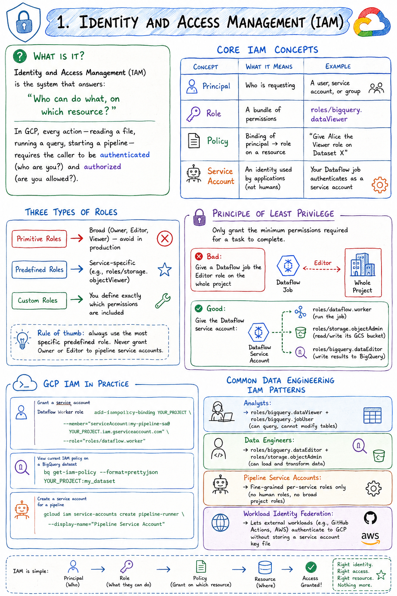

# GCP Data Engineering Review
---

## Table of Contents

1. Identity and Access Management
2. Data Security
3. Privacy
4. Regional Considerations
5. Legal and Regulatory Compliance
6. Preparing and Cleaning Data
7. Monitoring and Orchestration of Data Pipelines
8. Disaster Recovery and Fault Tolerance
9. ACID Compliance and Availability
10. Data Validation
11. Mapping Business Requirements to Architecture
12. Designing for Data and Application Portability
13. Data Staging, Cataloging, and Discovery
14. Designing Data Migrations

---

## 1. Identity and Access Management



### What Is It?

Identity and Access Management (IAM) is the system that answers: **"Who can do what, on which resource?"**

In GCP, every action — reading a file, running a query, starting a pipeline — requires the caller to be authenticated (who are you?) and authorized (are you allowed?).

### Core IAM Concepts

|Concept|What it means|Example|
|---|---|---|
|**Principal**|Who is requesting|A user, service account, or group|
|**Role**|A bundle of permissions|`roles/bigquery.dataViewer`|
|**Policy**|Binding of principal → role on a resource|"Give Alice the Viewer role on Dataset X"|
|**Service Account**|An identity used by applications (not humans)|Your Dataflow job authenticates as a service account|

### Three Types of Roles

```
Primitive Roles     →  Broad (Owner, Editor, Viewer) — avoid in production
Predefined Roles    →  Service-specific (e.g., roles/storage.objectViewer)
Custom Roles        →  You define exactly which permissions are included
```

**Rule of thumb: always use the most specific predefined role. Never grant Owner or Editor to pipeline service accounts.**

### Principle of Least Privilege

Only grant the minimum permissions required for a task to complete.

```
❌ Bad:   Give a Dataflow job the Editor role on the whole project
✅ Good:  Give the Dataflow service account:
            - roles/dataflow.worker         (run the job)
            - roles/storage.objectAdmin     (read/write its GCS bucket)
            - roles/bigquery.dataEditor     (write results to BigQuery)
```

### GCP IAM in Practice

```bash
# Grant a service account the Dataflow Worker role
gcloud projects add-iam-policy-binding YOUR_PROJECT \
  --member="serviceAccount:my-pipeline-sa@YOUR_PROJECT.iam.gserviceaccount.com" \
  --role="roles/dataflow.worker"

# View current IAM policy on a BigQuery dataset
bq get-iam-policy --format=prettyjson YOUR_PROJECT:my_dataset

# Create a service account for a pipeline
gcloud iam service-accounts create pipeline-runner \
  --display-name="Pipeline Service Account"
```

### Common Data Engineering IAM Patterns

```
Analysts:
  → roles/bigquery.dataViewer + roles/bigquery.jobUser
  (can query, cannot modify tables)

Data Engineers:
  → roles/bigquery.dataEditor + roles/storage.objectAdmin
  (can load and transform data)

Pipeline Service Accounts:
  → Fine-grained per-service roles only
  (no human roles, no broad project roles)

Workload Identity Federation:
  → Lets external workloads (e.g., GitHub Actions, AWS) authenticate
    to GCP without storing a service account key file
```

### Key Takeaway

Design IAM before writing any pipeline code. For every service your pipeline touches, create a dedicated service account with only the roles that service needs.

---

## 2. Data Security

### What Is It?

Data security covers protecting data from unauthorized access, modification, or destruction — both at rest (stored) and in transit (moving between services).

### Encryption at Rest

All GCP services encrypt data at rest by default using Google-managed encryption keys. For higher control:

```
Google-managed keys (default)
  → Automatic, no setup, sufficient for most cases

Customer-managed keys (CMEK) via Cloud KMS
  → You create and control the key
  → You can revoke access or rotate keys on your schedule
  → Required by some compliance frameworks

Customer-supplied keys (CSEK)
  → You provide the key material on every API call
  → GCP never stores your key
  → Highest control, highest operational burden
```

### Setting Up CMEK for BigQuery

```bash
# 1. Create a key ring and key in Cloud KMS
gcloud kms keyrings create my-keyring --location=us-central1

gcloud kms keys create my-bq-key \
  --keyring=my-keyring \
  --location=us-central1 \
  --purpose=encryption

# 2. Grant BigQuery permission to use the key
gcloud kms keys add-iam-policy-binding my-bq-key \
  --keyring=my-keyring \
  --location=us-central1 \
  --member="serviceAccount:bq-PROJECT_NUMBER@bigquery-encryption.iam.gserviceaccount.com" \
  --role="roles/cloudkms.cryptoKeyEncrypterDecrypter"

# 3. Create a dataset using that key
bq mk \
  --dataset \
  --default_kms_key=projects/PROJECT/locations/us-central1/keyRings/my-keyring/cryptoKeys/my-bq-key \
  my_secure_dataset
```

### Encryption in Transit

All GCP APIs use TLS 1.2+ by default. Data moving between GCP services (e.g., Dataflow workers reading from GCS) is encrypted automatically within Google's network.

For extra security between on-premises and GCP: use **VPN** or **Cloud Interconnect** rather than the public internet.

### VPC Service Controls

VPC Service Controls create a security perimeter around GCP services, preventing data from leaving the perimeter even if credentials are stolen.

```
Without VPC-SC:
  Stolen credentials → attacker calls BigQuery API → data exfiltrated

With VPC-SC:
  Stolen credentials → API call rejected (not from within the perimeter)
```

Useful for highly sensitive environments. Configured through Access Context Manager.

### Column-Level Security in BigQuery

```sql
-- Tag sensitive columns with policy tags in BigQuery
-- Then grant access to the tag, not the column

-- Example: SSN column is tagged as "sensitive/PII"
-- Only users with the "Fine-Grained Reader" role on that tag can see values
-- Everyone else sees NULL

SELECT customer_id, ssn  -- SSN appears as NULL if you lack the tag's permission
FROM `my_dataset.customers`;
```

### Key Takeaway

Security is layered: encryption protects stored data, TLS protects data in motion, VPC-SC protects against exfiltration, and column-level security limits what each user can see within a table.

---

## 3. Privacy

### What Is It?

Privacy in data engineering means handling **Personally Identifiable Information (PII)** — data that can identify a specific person — in a way that respects the individual and meets legal requirements.

### What Counts as PII?

```
Direct identifiers:     Name, email, phone, SSN, passport number
Quasi-identifiers:      Date of birth, zip code, job title (can identify when combined)
Sensitive categories:   Health data, financial data, biometric data, location history
```

### Privacy-Preserving Techniques

**1. Tokenization** — Replace the real value with a random token. A lookup table maps token → real value, stored separately.

```python
import hashlib
import secrets

def tokenize(value: str, salt: str) -> str:
    """Replace a real value with an irreversible token."""
    return hashlib.sha256(f"{salt}{value}".encode()).hexdigest()[:16]

# Original: "alice@example.com"
# Tokenized: "a3f7c2b1d9e04812"
# The mapping is stored in a separate, access-controlled lookup table
```

**2. Pseudonymization** — Similar to tokenization but reversible; the mapping key is stored securely. Required by GDPR for certain data uses.

**3. Anonymization** — Remove all identifiers so the record cannot be linked back to an individual. Truly anonymized data is no longer subject to privacy law — but true anonymization is harder than it looks.

**4. Data Masking** — Show only part of the value (e.g., `****-****-****-1234` for a credit card). Useful for logs and UIs.

**5. Generalization** — Replace a precise value with a range. Age 34 → "30–40". Zip 400001 → "400xxx".

### Cloud DLP (Data Loss Prevention)

Cloud DLP is a GCP service that automatically finds, classifies, and de-identifies sensitive data.

```python
# Use Cloud DLP to de-identify PII in text
from google.cloud import dlp_v2

client = dlp_v2.DlpServiceClient()
project = "your-project-id"

# Text containing PII
content = "Contact John Smith at john@example.com or call 555-123-4567."

# Configure what to detect and how to transform it
inspect_config = {
    "info_types": [
        {"name": "EMAIL_ADDRESS"},
        {"name": "PHONE_NUMBER"},
        {"name": "PERSON_NAME"},
    ]
}

# Replace detected PII with [INFO_TYPE] placeholder
deidentify_config = {
    "info_type_transformations": {
        "transformations": [{
            "primitive_transformation": {
                "replace_with_info_type_config": {}
            }
        }]
    }
}

item = {"value": content}
response = client.deidentify_content(
    request={
        "parent": f"projects/{project}",
        "deidentify_config": deidentify_config,
        "inspect_config": inspect_config,
        "item": item,
    }
)

print(response.item.value)
# Output: "Contact [PERSON_NAME] at [EMAIL_ADDRESS] or call [PHONE_NUMBER]."
```

### Right to Erasure (Right to Be Forgotten)

GDPR and similar laws give users the right to have their data deleted. In a data warehouse this is tricky because historical tables are immutable by design.

Design strategies:

- Store PII in a separate "identity" table keyed by a pseudonymous ID; delete from that table to sever the link
- Use BigQuery's `DELETE` statement for targeted row removal
- Use data retention policies to automatically expire old data

### Key Takeaway

Design your schema to isolate PII from analytics data from day one. It is far easier to separate identifiers at schema design time than to strip them retroactively from terabytes of historical data.

---

## 4. Regional Considerations

### What Is It?

GCP resources exist in specific physical locations. Where you place data and compute affects latency, cost, compliance, and resilience.

### GCP Location Hierarchy

```
Multi-region  (e.g., US, EU, ASIA)
  → Data replicated across multiple regions automatically
  → Highest availability, higher cost
  → Best for: global access, disaster recovery

Region  (e.g., us-central1, europe-west1, asia-south1)
  → A geographic area with 3+ zones
  → Best for: most production workloads, compliance with data residency rules

Zone  (e.g., us-central1-a, us-central1-b)
  → A single data center within a region
  → Best for: low-latency zone-specific compute
```

### Data Residency

Some regulations require data to stay within a country or region. For example:

- EU GDPR: Personal data of EU residents must not leave the EU without adequate safeguards
- India PDPB: Certain sensitive personal data must be stored in India

```bash
# Store a BigQuery dataset only in the EU multi-region
bq mk --dataset --location=EU my_eu_dataset

# Create a GCS bucket in a specific Indian region
gsutil mb -l asia-south1 gs://my-india-compliant-bucket/

# Note: once a dataset is created, its location cannot be changed
# Plan your locations before creating resources
```

### Co-locating Compute and Storage

Always run compute in the same region as your data. Cross-region data transfer costs money and adds latency.

```
❌ Bad:   BigQuery dataset in US + Dataflow job in europe-west1
          → Cross-region reads, network egress charges

✅ Good:  BigQuery dataset in us-central1 + Dataflow job in us-central1
          → Same region, no egress charges, lower latency
```

### Choosing a Region — Decision Checklist

```
1. Where do your users/applications primarily operate?
   → Choose the nearest region for lowest latency

2. Are there data residency requirements?
   → Constrain to the required country/region

3. Do you need the highest availability?
   → Use a multi-region location (US, EU, ASIA)

4. Are you cost-sensitive?
   → Some regions are cheaper; compare pricing pages

5. Do you need specific GCP services?
   → Not all services are available in all regions
   → Check the GCP products-by-region page before committing
```

### Key Takeaway

Regional decisions are hard to undo. Set location on every resource explicitly and document why. Never let GCP default to a region that may violate compliance requirements.

---

## 5. Legal and Regulatory Compliance

### What Is It?

Compliance means building systems that meet external rules — laws, industry standards, and contractual obligations — around how data is collected, stored, processed, and shared.

### Common Frameworks in Data Engineering

|Framework|Who it applies to|Key requirements|
|---|---|---|
|**GDPR**|Anyone handling EU residents' data|Consent, right to erasure, data minimization, breach notification in 72 hours|
|**HIPAA**|US healthcare data|PHI encryption, access logs, BAA with cloud providers|
|**PCI-DSS**|Payment card data|Encryption, network segmentation, access controls, audit logs|
|**SOC 2**|SaaS providers|Security, availability, confidentiality, processing integrity|
|**ISO 27001**|Any organization|Information security management system|
|**India DPDP Act**|Personal data of Indian residents|Consent, data minimization, grievance officer|

### GCP Compliance Certifications

GCP itself is certified for most of these frameworks. When you run workloads on GCP, Google's infrastructure-level compliance is inherited — but **your application-level controls are your responsibility**.

```
Google's responsibility:      Physical security, hardware, hypervisor, network
Your responsibility:          IAM, encryption key management, data classification,
                              access logs, retention policies, application controls
```

### Audit Logging

For compliance, every access to sensitive data must be logged.

```bash
# Enable Data Access audit logs for BigQuery
gcloud projects get-iam-policy YOUR_PROJECT > policy.yaml

# Add to policy.yaml:
# auditConfigs:
# - auditLogConfigs:
#   - logType: DATA_READ
#   - logType: DATA_WRITE
#   service: bigquery.googleapis.com

gcloud projects set-iam-policy YOUR_PROJECT policy.yaml
```

Logs flow to Cloud Logging and can be exported to BigQuery for analysis:

```sql
-- Query audit logs in BigQuery to find who accessed a sensitive table
SELECT
  timestamp,
  protopayload_auditlog.authenticationInfo.principalEmail AS user,
  protopayload_auditlog.resourceName                      AS resource,
  protopayload_auditlog.methodName                        AS action
FROM
  `YOUR_PROJECT.DATASET._AllLogs`
WHERE
  protopayload_auditlog.resourceName LIKE '%sensitive_table%'
  AND DATE(timestamp) = CURRENT_DATE()
ORDER BY timestamp DESC;
```

### Data Retention and Deletion

Compliance frameworks often specify how long you may keep data and when you must delete it.

```bash
# Set a retention policy on a GCS bucket (data cannot be deleted before 7 years)
gsutil retention set 7y gs://my-regulated-bucket/

# Set BigQuery table expiration (data auto-deletes after 365 days)
bq update \
  --expiration 31536000 \  # seconds = 365 days
  my_project:my_dataset.my_table
```

### Key Takeaway

Compliance is not a one-time checkbox. It requires ongoing controls: regular access reviews, log monitoring, retention enforcement, and staying current as regulations evolve. Build compliance into your architecture from day one, not after an audit finds a gap.

---

## 6. Preparing and Cleaning Data

### What Is It?

Raw data is almost never ready for analysis. Preparing and cleaning data means finding and fixing quality problems — missing values, wrong types, duplicates, inconsistent formats, outliers — before data reaches consumers.

### Common Data Quality Problems

```
Missing values:          NULL where a value is required
Wrong data types:        "2024-01-15" stored as a string, not a DATE
Inconsistent formats:    "India", "IND", "IN" all meaning the same country
Duplicates:              The same event recorded twice
Outliers/errors:         Age = 999, negative prices
Referential integrity:   An order references a customer_id that doesn't exist
Schema drift:            Upstream added a new column, downstream breaks
```

### Tool 1 — Dataflow (Apache Beam) for Programmatic Cleaning

Best for: large-scale, repeatable, code-defined transformations.

```python
# Example: Clean a raw user events CSV in Dataflow
import apache_beam as beam
from apache_beam import Row
import re
from datetime import datetime

def clean_event(record):
    """Normalize and validate a raw event record."""
    errors = []

    # Normalize country code
    country_map = {"india": "IN", "united states": "US", "usa": "US", "uk": "GB"}
    country_raw = record.get("country", "").strip().lower()
    country = country_map.get(country_raw, country_raw.upper())

    # Parse and validate timestamp
    ts_raw = record.get("timestamp", "")
    try:
        ts = datetime.strptime(ts_raw, "%Y-%m-%d %H:%M:%S")
    except ValueError:
        errors.append(f"bad_timestamp:{ts_raw}")
        ts = None

    # Validate amount
    try:
        amount = float(record.get("amount", 0))
        if amount < 0:
            errors.append("negative_amount")
    except ValueError:
        amount = None
        errors.append("non_numeric_amount")

    return Row(
        user_id=record.get("user_id", "").strip(),
        country=country,
        timestamp=str(ts) if ts else None,
        amount=amount,
        _errors=",".join(errors) if errors else None,
    )

with beam.Pipeline() as p:
    raw = (
        p
        | "Read" >> beam.io.ReadFromText("raw_events.csv", skip_header_lines=1)
        | "Parse" >> beam.Map(lambda line: dict(
            zip(["user_id","country","timestamp","amount"], line.split(","))
        ))
        | "Clean" >> beam.Map(clean_event)
    )

    # Route to clean or quarantine based on errors
    clean = raw | "Filter Clean"  >> beam.Filter(lambda r: r._errors is None)
    dirty = raw | "Filter Dirty"  >> beam.Filter(lambda r: r._errors is not None)

    clean | "Write Clean"      >> beam.io.WriteToText("clean_events")
    dirty | "Write Quarantine" >> beam.io.WriteToText("quarantine_events")
```

### Tool 2 — Dataprep by Trifacta (now Alteryx Designer Cloud)

Best for: visual, self-service data wrangling by analysts without writing code.

Key features:

- Automatically profiles data and suggests transformations
- Visual recipe builder — no code required
- Detects anomalies, mismatches, and missing values with a histogram per column
- Exports transformation recipes to Dataflow jobs for production runs

Typical workflow:

```
1. Connect Dataprep to GCS or BigQuery
2. Import a sample of your dataset
3. Dataprep profiles it and highlights quality issues
4. Build a visual "recipe" of transformations (trim, replace, filter, deduplicate)
5. Run the recipe at scale via Dataflow
6. Output lands back in BigQuery or GCS
```

### Tool 3 — Cloud Data Fusion

Best for: building ETL/ELT pipelines with a drag-and-drop UI. Useful when integrating many different source systems.

```
Cloud Data Fusion architecture:

[Source Plugins]  →  [Transform Plugins]  →  [Sink Plugins]
  MySQL               Wrangler (visual)        BigQuery
  Salesforce          Joiner                   GCS
  GCS                 Deduplicate              Spanner
  Kafka               Filter                   Pub/Sub
  JDBC                Normalize
```

Internally it generates Apache Spark or MapReduce jobs to execute the pipeline.

### Choosing the Right Tool

|Situation|Best tool|
|---|---|
|Need code-level control, complex logic|Dataflow (Apache Beam)|
|Analyst wants visual wrangling, no code|Dataprep|
|Integrating many heterogeneous sources with drag-and-drop|Cloud Data Fusion|
|One-off exploration in a notebook|BigQuery + pandas or Colab|

### Key Takeaway

Data cleaning is not a one-time task — it's a pipeline stage. Build cleaning logic as code so it is repeatable, testable, and version-controlled. Track rejected records in a quarantine table and monitor the quarantine rate over time.

---

## 7. Monitoring and Orchestration of Data Pipelines

### What Is It?

Monitoring means knowing when something is wrong. Orchestration means coordinating when and how pipeline steps run. Both are essential for reliable data systems.

### Orchestration: Cloud Composer (Apache Airflow on GCP)

Cloud Composer is a managed Apache Airflow service. You define pipelines as DAGs (Directed Acyclic Graphs) in Python.

```python
# Example DAG: daily ETL pipeline
from airflow import DAG
from airflow.providers.google.cloud.operators.dataflow import DataflowCreatePythonJobOperator
from airflow.providers.google.cloud.operators.bigquery import BigQueryInsertJobOperator
from airflow.providers.google.cloud.sensors.gcs import GCSObjectExistenceSensor
from datetime import datetime, timedelta

default_args = {
    "owner":            "data-engineering-team",
    "retries":          3,
    "retry_delay":      timedelta(minutes=5),
    "email_on_failure": True,
    "email":            ["alerts@yourcompany.com"],
}

with DAG(
    dag_id="daily_sales_etl",
    default_args=default_args,
    start_date=datetime(2024, 1, 1),
    schedule_interval="0 6 * * *",   # 6 AM daily
    catchup=False,
    tags=["sales", "etl"],
) as dag:

    # Step 1: Wait for upstream file to land in GCS
    wait_for_file = GCSObjectExistenceSensor(
        task_id="wait_for_source_file",
        bucket="my-ingestion-bucket",
        object="daily/sales_{{ ds_nodash }}.csv",   # ds_nodash = date like 20240115
        timeout=3600,   # wait up to 1 hour
        poke_interval=60,
    )

    # Step 2: Run Dataflow job to clean and transform
    run_dataflow = DataflowCreatePythonJobOperator(
        task_id="run_cleaning_pipeline",
        py_file="gs://my-bucket/pipelines/clean_sales.py",
        job_name="clean-sales-{{ ds_nodash }}",
        options={
            "input":  "gs://my-ingestion-bucket/daily/sales_{{ ds_nodash }}.csv",
            "output": "gs://my-staging-bucket/clean/sales_{{ ds_nodash }}/",
            "runner": "DataflowRunner",
            "project": "my-project",
            "region":  "us-central1",
        },
    )

    # Step 3: Load clean data into BigQuery
    load_to_bq = BigQueryInsertJobOperator(
        task_id="load_to_bigquery",
        configuration={
            "load": {
                "sourceUris": ["gs://my-staging-bucket/clean/sales_{{ ds_nodash }}/*.json"],
                "destinationTable": {
                    "projectId": "my-project",
                    "datasetId": "sales",
                    "tableId":   "daily_sales${{ ds_nodash }}",  # partition by date
                },
                "sourceFormat": "NEWLINE_DELIMITED_JSON",
                "writeDisposition": "WRITE_TRUNCATE",
            }
        },
    )

    # Define the execution order
    wait_for_file >> run_dataflow >> load_to_bq
```

### Monitoring: What to Track

```
Pipeline health:
  - Job success/failure rate
  - Job duration (alert if > 2x baseline)
  - Number of elements processed
  - Records written to sink vs records read from source

Data quality:
  - Quarantine rate (% of records rejected)
  - Late-arriving data rate
  - Schema validation failures

Infrastructure:
  - Dataflow worker CPU and memory utilization
  - GCS/BigQuery slot utilization
  - Pub/Sub backlog (for streaming)
```

### Setting Up Alerts in Cloud Monitoring

```bash
# Create an alerting policy: alert if a Dataflow job fails
gcloud alpha monitoring policies create \
  --notification-channels=CHANNEL_ID \
  --display-name="Dataflow Job Failure" \
  --condition-display-name="Job failed" \
  --condition-filter='resource.type="dataflow_job" AND metric.type="dataflow.googleapis.com/job/is_failed" AND metric.labels.job_status="JOB_STATE_FAILED"' \
  --condition-threshold-value=0 \
  --condition-threshold-comparison=COMPARISON_GT
```

Or in Python using the Monitoring client:

```python
from google.cloud import monitoring_v3

client = monitoring_v3.AlertPolicyServiceClient()
project_name = f"projects/my-project"

# Define the alert condition
condition = monitoring_v3.AlertPolicy.Condition(
    display_name="Dataflow job failed",
    condition_threshold=monitoring_v3.AlertPolicy.Condition.MetricThreshold(
        filter='metric.type="dataflow.googleapis.com/job/is_failed"',
        comparison=monitoring_v3.ComparisonType.COMPARISON_GT,
        threshold_value=0,
        duration={"seconds": 60},
    ),
)

policy = monitoring_v3.AlertPolicy(
    display_name="Dataflow Pipeline Failure Alert",
    conditions=[condition],
    notification_channels=["projects/my-project/notificationChannels/CHANNEL_ID"],
    alert_strategy=monitoring_v3.AlertPolicy.AlertStrategy(
        auto_close={"seconds": 86400}
    ),
)
client.create_alert_policy(name=project_name, alert_policy=policy)
```

### Key Takeaway

Treat your pipelines like production software services: define SLAs (e.g., "data must be in BigQuery by 7 AM"), instrument them, and alert on violations before downstream users notice.

---

## 8. Disaster Recovery and Fault Tolerance

### What Is It?

Disaster recovery (DR) is your plan for what happens when something fails — hardware outage, accidental deletion, a bug that corrupts data. Fault tolerance means designing systems that keep running despite individual failures.

### Key Metrics

```
RTO — Recovery Time Objective
  "How long can we be down before it causes serious damage?"
  Example: RTO = 4 hours means service must be restored within 4 hours

RPO — Recovery Point Objective
  "How much data loss is acceptable?"
  Example: RPO = 1 hour means we can lose at most 1 hour of data

Lower RTO and RPO = higher resilience = higher cost
```

### GCP Managed Services — Built-In Fault Tolerance

Most managed GCP data services are fault-tolerant by design:

|Service|Built-in fault tolerance|
|---|---|
|BigQuery|Data replicated across multiple zones automatically|
|Cloud Storage|Standard class: 99.999999999% durability (multi-zone replication)|
|Cloud Spanner|Multi-region: survives complete regional failure|
|Pub/Sub|Messages replicated across zones; at-least-once delivery guaranteed|
|Dataflow|Automatic retry of failed work items; state checkpointing for streaming|

### Dataflow Fault Tolerance

Dataflow handles transient failures automatically:

```python
# Dataflow retries failed bundles automatically
# For streaming pipelines, it checkpoints state so it can resume
# You configure max retry attempts:

from apache_beam.options.pipeline_options import PipelineOptions

options = PipelineOptions(
    runner="DataflowRunner",
    max_num_workers=10,
    # Number of times to retry a failing bundle before failing the job
    # Default is 4
    number_of_worker_harness_threads=2,
)

# For streaming: Dataflow checkpoints every element processed
# If a worker dies, work is reassigned to another worker
# Exactly-once processing is guaranteed with the Streaming Engine
```

### Backup Strategies

**BigQuery: Table Snapshots**

```sql
-- Create a snapshot of a table before a risky operation
CREATE SNAPSHOT TABLE my_dataset.orders_backup_20240115
CLONE my_dataset.orders
FOR SYSTEM_TIME AS OF TIMESTAMP_SUB(CURRENT_TIMESTAMP(), INTERVAL 0 MINUTE)
OPTIONS (expiration_timestamp = TIMESTAMP_ADD(CURRENT_TIMESTAMP(), INTERVAL 7 DAY));

-- Restore from a snapshot if something goes wrong
CREATE OR REPLACE TABLE my_dataset.orders
CLONE my_dataset.orders_backup_20240115;
```

**BigQuery: Time Travel**

BigQuery automatically retains 7 days of historical table state (up to 90 days with fail-safe).

```sql
-- Query table as it was 24 hours ago
SELECT * FROM my_dataset.orders
FOR SYSTEM_TIME AS OF TIMESTAMP_SUB(CURRENT_TIMESTAMP(), INTERVAL 24 HOUR);

-- Restore a table to how it looked yesterday
CREATE OR REPLACE TABLE my_dataset.orders AS
SELECT * FROM my_dataset.orders
FOR SYSTEM_TIME AS OF '2024-01-14 12:00:00 UTC';
```

**GCS: Versioning and Replication**

```bash
# Enable versioning on a bucket
gsutil versioning set on gs://my-important-bucket/

# List all versions of a file
gsutil ls -a gs://my-important-bucket/data/file.csv

# Restore a previous version
gsutil cp gs://my-important-bucket/data/file.csv#VERSION_ID gs://my-important-bucket/data/file.csv

# Replicate to another region for DR
gsutil rewrite -r -s STANDARD gs://source-bucket/ gs://dr-bucket/
```

### Multi-Region DR Architecture

```
Primary Region (us-central1)
  └─ BigQuery dataset
  └─ GCS bucket (standard)
  └─ Dataflow jobs

DR Region (us-east1)
  └─ BigQuery dataset (scheduled daily export + import)
  └─ GCS bucket (configured as replication target)
  └─ Dataflow job templates stored, ready to launch

Failover process:
  1. Detect primary region degraded (Cloud Monitoring alert)
  2. Switch DNS / application config to point to DR region
  3. Launch Dataflow jobs from stored templates in DR region
  4. Validate data integrity in DR BigQuery dataset
  5. Resume operations
```

### Key Takeaway

Know your RTO and RPO before designing DR. For most GCP managed services, the platform provides the infrastructure resilience — your responsibility is the data backup strategy and the runbook for what your team does during an outage.

---

## 9. ACID Compliance and Availability

### What Is ACID?

ACID is a set of properties that guarantee database transactions are reliable:

```
Atomicity     — A transaction either fully succeeds or fully fails.
                No partial writes. (All-or-nothing)

Consistency   — A transaction brings the database from one valid state
                to another. No rules are violated.

Isolation     — Concurrent transactions do not interfere with each other.
                Each sees a consistent snapshot.

Durability    — Once a transaction is committed, it stays committed
                even if the system crashes immediately after.
```

### ACID vs Eventual Consistency

||ACID (Strong Consistency)|Eventual Consistency|
|---|---|---|
|**Guarantee**|Every read returns the latest write|Reads may lag behind writes, but will converge|
|**Latency**|Higher (coordination overhead)|Lower|
|**Throughput**|Lower|Higher|
|**Best for**|Financial data, inventory, orders|Analytics, caching, social feeds|

### GCP Services and Consistency

```
Full ACID (transactional):
  Cloud Spanner     → Global ACID, unlimited scale, highest cost
  Cloud SQL         → ACID within a single instance (MySQL/PostgreSQL)
  AlloyDB           → ACID, PostgreSQL-compatible, high performance
  BigQuery          → ACID for DML (INSERT/UPDATE/DELETE) since 2021

Eventual / near-real-time:
  Bigtable          → Strong consistency within a single row; eventual across rows
  Firestore         → Strongly consistent reads within a session
  Cloud Storage     → Strongly consistent for most operations since 2021 update

Analytics (not transactional):
  BigQuery          → Optimized for reads, not OLTP-style point updates
```

### BigQuery and ACID

BigQuery supports ACID transactions for DML statements:

```sql
-- This transaction is atomic: either both updates happen or neither does
BEGIN TRANSACTION;

  UPDATE my_dataset.accounts
  SET balance = balance - 500
  WHERE account_id = 'A001';

  UPDATE my_dataset.accounts
  SET balance = balance + 500
  WHERE account_id = 'A002';

COMMIT TRANSACTION;

-- If any statement fails, ROLLBACK TRANSACTION undoes both
```

BigQuery also supports **merge** for upsert patterns:

```sql
-- Upsert: insert new records, update existing ones
MERGE my_dataset.customers AS target
USING my_dataset.customers_updates AS source
ON target.customer_id = source.customer_id

WHEN MATCHED THEN
  UPDATE SET
    email = source.email,
    updated_at = CURRENT_TIMESTAMP()

WHEN NOT MATCHED THEN
  INSERT (customer_id, email, created_at)
  VALUES (source.customer_id, source.email, CURRENT_TIMESTAMP());
```

### Availability vs Consistency (CAP Theorem)

The CAP theorem states a distributed system can guarantee only two of three properties simultaneously:

- **Consistency** — every read gets the latest write
- **Availability** — every request gets a response
- **Partition tolerance** — the system continues working even if network splits occur

In practice, partition tolerance is required for any distributed system. So the real tradeoff is:

```
CP (Consistency + Partition tolerance):
  → May reject requests during a partition to stay consistent
  → Examples: Spanner, HBase, Zookeeper

AP (Availability + Partition tolerance):
  → Always responds, but may return stale data
  → Examples: Cassandra, DynamoDB (eventually consistent reads), Bigtable
```

### Choosing the Right Consistency Model

```
Use strong consistency (ACID) when:
  → Financial transactions (money must not be double-spent)
  → Inventory management (can't oversell)
  → Order management (order status must be accurate)

Use eventual consistency when:
  → User profile updates (slight lag is fine)
  → Analytics (historical aggregations)
  → Recommendation systems (stale by minutes is acceptable)
  → Social feed updates
```

### Key Takeaway

Match the consistency model to the business requirement. Using ACID for everything is expensive and slow; using eventual consistency for financial data is dangerous. The right choice depends entirely on what "wrong data" costs the business.

---

## 10. Data Validation

### What Is It?

Data validation is the process of verifying that data meets defined quality rules before it is used in analytics, ML training, or downstream systems.

### Types of Validation Checks

```
Schema validation:         Are all required columns present and of the correct type?
Null/completeness checks:  Are required fields populated?
Range checks:              Is the value within expected bounds? (age between 0-120)
Format checks:             Does the email look like an email?
Referential integrity:     Does every foreign key point to an existing record?
Uniqueness checks:         Are there duplicate records?
Distribution checks:       Has the statistical profile changed significantly?
Business rule checks:      Revenue cannot be negative; order date <= ship date
```

### Validation in BigQuery with SQL

```sql
-- Run a suite of validation checks and report results
WITH checks AS (

  SELECT 'null_user_id'  AS check_name,
         COUNT(*)        AS failures
  FROM my_dataset.orders
  WHERE user_id IS NULL

  UNION ALL

  SELECT 'negative_amount',
         COUNT(*)
  FROM my_dataset.orders
  WHERE amount < 0

  UNION ALL

  SELECT 'future_order_date',
         COUNT(*)
  FROM my_dataset.orders
  WHERE order_date > CURRENT_DATE()

  UNION ALL

  SELECT 'duplicate_order_id',
         COUNT(*) - COUNT(DISTINCT order_id)
  FROM my_dataset.orders

)

SELECT
  check_name,
  failures,
  CASE WHEN failures = 0 THEN '✅ PASS' ELSE '❌ FAIL' END AS result
FROM checks
ORDER BY failures DESC;
```

### Validation in Dataflow Pipelines

```python
import apache_beam as beam
import re
from apache_beam import Row

def validate(record):
    """Return (record, list_of_errors). Empty list means valid."""
    errors = []

    if not record.user_id or not record.user_id.strip():
        errors.append("MISSING_USER_ID")

    if record.amount is None or record.amount < 0:
        errors.append("INVALID_AMOUNT")

    if record.email and not re.match(r"[^@]+@[^@]+\.[^@]+", record.email):
        errors.append("BAD_EMAIL_FORMAT")

    if record.event_date and record.event_date > "2099-12-31":
        errors.append("FUTURE_DATE")

    return record, errors

with beam.Pipeline() as p:
    records = p | "Read" >> beam.io.ReadFromText("events.jsonl")

    validated = (
        records
        | "Parse"    >> beam.Map(lambda l: __import__("json").loads(l))
        | "To Row"   >> beam.Map(lambda d: Row(**d))
        | "Validate" >> beam.Map(validate)
    )

    valid = (
        validated
        | "Keep Valid"  >> beam.Filter(lambda rv: len(rv[1]) == 0)
        | "Unwrap"      >> beam.Map(lambda rv: rv[0])
    )

    invalid = (
        validated
        | "Keep Invalid" >> beam.Filter(lambda rv: len(rv[1]) > 0)
        | "Format Error" >> beam.Map(
            lambda rv: f"{rv[0]},{','.join(rv[1])}"
        )
    )

    valid   | "Write Valid"     >> beam.io.WriteToText("valid_events")
    invalid | "Write Quarantine" >> beam.io.WriteToText("quarantine_events")
```

### Statistical / Distribution Validation with TFX Data Validation

For ML pipelines, statistical drift in training data is a common silent failure. TFX Data Validation (TFDV) can detect it:

```python
import tensorflow_data_validation as tfdv

# Generate statistics from a known-good baseline
baseline_stats = tfdv.generate_statistics_from_csv("baseline_data.csv")

# Infer a schema from the baseline
schema = tfdv.infer_schema(baseline_stats)

# Generate statistics from new data
new_stats = tfdv.generate_statistics_from_csv("new_data.csv")

# Compare — detect anomalies and drift
anomalies = tfdv.validate_statistics(new_stats, schema)
tfdv.display_anomalies(anomalies)

# Example anomaly: "Column 'age' has values outside [0, 120]"
# Example anomaly: "Column 'country' has a new value 'XY' not seen in baseline"
```

### Key Takeaway

Validation should happen at every pipeline boundary — at ingestion, after transformation, and before loading to the serving layer. Treat validation failures as data incidents, not silent drops. Alert on quarantine rates.

---

## 11. Mapping Business Requirements to Architecture

### What Is It?

Every architecture decision should trace back to a business requirement. This section covers how to translate "what the business needs" into "what GCP services and patterns to use."

### The Requirements Translation Process

```
Step 1: Gather requirements
  → Who are the consumers of this data? (analysts, ML models, APIs, reports)
  → What latency is acceptable? (real-time, near-real-time, daily batch)
  → How much data? (GB per day, TB per day, PB total)
  → How often does the schema change?
  → What are the SLAs? ("Data must be available by 7 AM")

Step 2: Classify the workload
  → OLTP (transactional) vs OLAP (analytical)
  → Batch vs streaming vs interactive
  → Structured vs semi-structured vs unstructured

Step 3: Map to GCP services
  → Match each requirement to the service that best fits it

Step 4: Document trade-offs
  → Every choice has pros and cons; write them down
```

### Common Business Requirements → Architecture Mapping

|Business requirement|Architecture choice|
|---|---|
|"Analysts need to run ad-hoc SQL on petabytes"|BigQuery (serverless OLAP)|
|"We need real-time fraud detection (< 100ms)"|Bigtable (low-latency key-value reads)|
|"We need to store IoT sensor data forever"|GCS (cold storage) → BigQuery (analytics)|
|"We need a product catalog with ACID updates"|Cloud Spanner or Cloud SQL|
|"We need to process 10M events/second from sensors"|Pub/Sub → Dataflow → BigQuery|
|"Marketing needs a daily report by 6 AM"|Cloud Composer DAG, BigQuery scheduled query|
|"ML team needs clean, labeled training data"|Cloud Data Fusion → BigQuery → Vertex AI|

### Worked Example: E-Commerce Platform

**Business requirements stated in a meeting:**

- Order data must be queryable within 5 minutes of the order being placed
- Finance team needs end-of-day reports by 6 AM
- Customer support needs to look up any individual order instantly
- The data science team trains churn models monthly on 2 years of history
- We must comply with GDPR (EU customers)

**Translated architecture:**

```
Order events → Pub/Sub (ingestion buffer)
             ↓
           Dataflow (real-time processing, cleaning, PII tokenization)
             ↓               ↓
      BigQuery             Bigtable
   (analytics/reports)   (customer support lookup,
                          single-order queries < 5ms)

Cloud Composer DAG:
  - Runs nightly at 2 AM
  - Aggregates BigQuery data for finance report
  - Triggers scheduled export to reporting tool by 5:45 AM

ML Pipeline:
  - Monthly: Cloud Composer triggers Vertex AI pipeline
  - Reads 2 years of history from BigQuery
  - Trains churn model, deploys to Vertex AI endpoint

GDPR:
  - PII tokenized at the Dataflow stage (before any storage)
  - Deletion requests: remove from Bigtable + BigQuery identity table
  - Data stored in EU multi-region (BigQuery + GCS)
  - Audit logs exported to BigQuery for compliance review
```

### Key Takeaway

Never start with "what services should we use?" Start with "what does the business actually need?" The architecture follows from the requirements, not the other way around.

---

## 12. Designing for Data and Application Portability

### What Is It?

Portability means designing your data and applications so they are not permanently locked into a single vendor, service, or format — making it possible to move, evolve, or migrate without a full rebuild.

### Why Portability Matters

- Avoid vendor lock-in: if GCP pricing changes or a better tool emerges, you can move
- Enable multi-cloud: run workloads on GCP and AWS simultaneously
- Simplify migration: move from on-premises to cloud, or between cloud regions
- Support open standards: ensures other tools can read your data

### Open Formats Over Proprietary Formats

```
❌ Proprietary formats (harder to move):
  - Native BigQuery internal storage (not directly readable outside BQ)
  - Vendor-specific binary formats

✅ Open formats (portable):
  - Parquet      → columnar, compressed, widely supported (BigQuery, Spark, Athena, Pandas)
  - Avro         → row-based, self-describing schema, great for Kafka/streaming
  - ORC          → columnar, Hive-native but broadly supported
  - Delta Lake   → open table format with ACID, versioning, time travel
  - JSON / JSONL → universal but large; best for interchange
  - CSV          → maximum portability, minimum features
```

### Using Parquet for Portability

```python
# Write Parquet from a Dataflow pipeline — any system can read it
import apache_beam as beam
from apache_beam.io import fileio
import pyarrow as pa
import pyarrow.parquet as pq

schema = pa.schema([
    ("user_id",    pa.string()),
    ("event_type", pa.string()),
    ("amount",     pa.float64()),
    ("timestamp",  pa.timestamp("us")),
])

# In a pipeline, write to Parquet on GCS
# Any system (Spark, Athena, Databricks, pandas) can read this output
(
    records
    | "Write Parquet" >> beam.io.WriteToParquet(
        file_path_prefix="gs://my-bucket/output/events",
        schema=schema,
        file_name_suffix=".parquet",
        codec="snappy",         # widely supported compression
    )
)
```

### Containerization for Application Portability

Containerizing pipeline code means it can run on Dataflow today and on Spark or Kubernetes tomorrow.

```dockerfile
# Dockerfile for a Beam pipeline
FROM apache/beam_python3.10_sdk:2.55.0

WORKDIR /app
COPY requirements.txt .
RUN pip install -r requirements.txt

COPY pipeline/ ./pipeline/

# Run locally with DirectRunner
ENTRYPOINT ["python", "pipeline/main.py"]
```

```bash
# Build and push the container
docker build -t gcr.io/my-project/my-pipeline:v1.0 .
docker push gcr.io/my-project/my-pipeline:v1.0

# Run on Dataflow using the container
python pipeline/main.py \
  --runner=DataflowRunner \
  --sdk_container_image=gcr.io/my-project/my-pipeline:v1.0 \
  --project=my-project \
  --region=us-central1
```

### BigQuery Omni (Multi-Cloud Queries)

BigQuery Omni lets you query data sitting in AWS S3 or Azure Blob Storage directly from BigQuery — without moving the data.

```sql
-- Query a table whose data physically lives in AWS S3
-- BigQuery Omni runs the compute in AWS, returns results to GCP
SELECT country, SUM(revenue) AS total_revenue
FROM my_aws_connection.sales_dataset.transactions
WHERE year = 2024
GROUP BY country;
```

### Key Takeaway

Design for portability by defaulting to open formats (Parquet, Avro), open APIs (standard SQL, Apache Beam), and containers. The goal is not to avoid GCP — it's to ensure that your data and logic are not permanently fused to any single service in a way that makes evolution impossible.

---

## 13. Data Staging, Cataloging, and Discovery

### What Is It?

Before data reaches analysts or ML models, it passes through a series of stages (raw → clean → serving). Cataloging means maintaining a searchable inventory of what data exists and where. Discovery means making it easy for users to find the data they need.

### Data Staging Zones (Medallion Architecture)

```
Raw Zone (Bronze)
  → Data exactly as it arrived: no transformation, no cleaning
  → Purpose: audit, reprocessing, debugging
  → Storage: GCS (coldline or nearline for cost)
  → Retention: long (months to years)

Clean Zone (Silver)
  → Data validated, deduplicated, type-corrected, PII tokenized
  → Purpose: source of truth for transformations
  → Storage: BigQuery or GCS (Parquet)

Serving Zone (Gold)
  → Aggregated, business-ready tables and views
  → Purpose: dashboards, reports, ML features
  → Storage: BigQuery (optimized for query performance)
```

```bash
# Typical GCS bucket structure for staging zones
gs://company-data-lake/
  raw/                    ← Bronze: raw files as received
    sales/
      2024/01/15/
        sales_raw.csv
  clean/                  ← Silver: validated, cleaned Parquet
    sales/
      date=2024-01-15/
        part-00000.parquet
  serving/                ← Gold: aggregated, query-ready
    daily_sales_summary/
      date=2024-01-15/
        summary.parquet
```

### Data Cataloging with Dataplex and Data Catalog

**Data Catalog** is GCP's managed metadata service. It provides a searchable inventory of all data assets across BigQuery, GCS, Pub/Sub, and more.

```python
from google.cloud import datacatalog_v1

client = datacatalog_v1.DataCatalogClient()

# Tag a BigQuery table with business metadata
# First, create a tag template
template = datacatalog_v1.TagTemplate()
template.display_name = "Sales Data Template"
template.fields["owner"] = datacatalog_v1.TagTemplateField(
    display_name="Data Owner",
    type_=datacatalog_v1.FieldType(
        primitive_type=datacatalog_v1.FieldType.PrimitiveType.STRING
    ),
)
template.fields["data_classification"] = datacatalog_v1.TagTemplateField(
    display_name="Classification",
    type_=datacatalog_v1.FieldType(
        enum_type=datacatalog_v1.FieldType.EnumType(
            allowed_values=[
                {"display_name": "PUBLIC"},
                {"display_name": "INTERNAL"},
                {"display_name": "CONFIDENTIAL"},
            ]
        )
    ),
)

# Then tag a specific table
tag = datacatalog_v1.Tag()
tag.template = "projects/my-project/locations/us-central1/tagTemplates/sales_template"
tag.fields["owner"] = datacatalog_v1.TagField(string_value="data-engineering@company.com")
tag.fields["data_classification"] = datacatalog_v1.TagField(
    enum_value=datacatalog_v1.TagField.EnumValue(display_name="INTERNAL")
)
```

### Dataplex — Data Mesh on GCP

Dataplex is GCP's data mesh platform. It organizes data into **lakes → zones → assets** and provides centralized governance, quality monitoring, and discovery across them.

```
Dataplex Lake: "Company Data Lake"
  ├── Zone: "Raw Zone"            (maps to GCS bucket: gs://company-raw/)
  │     └── Asset: "Sales Raw"   (maps to gs://company-raw/sales/)
  │
  ├── Zone: "Curated Zone"        (maps to BigQuery dataset: company_clean)
  │     └── Asset: "Clean Sales" (maps to company_clean.sales table)
  │
  └── Zone: "Serving Zone"        (maps to BigQuery dataset: company_serving)
        └── Asset: "KPIs"         (maps to company_serving.daily_kpis)
```

Key Dataplex capabilities:

- Automatically discovers and catalogs assets within zones
- Runs data quality checks on a schedule across all assets
- Provides centralized access control across GCS and BigQuery together
- Enables data lineage tracking (where did this data come from?)

### Data Lineage

Data lineage tracks the journey of data from source to destination — who created it, what transformed it, where it went.

BigQuery and Dataplex provide automatic lineage for:

- BigQuery tables created by SQL queries
- Dataflow jobs reading/writing BigQuery tables
- Data Fusion pipeline outputs

You can view lineage in the Data Catalog UI or query it via the Lineage API.

### Key Takeaway

Without a catalog, data lakes become data swamps. Implement tagging and metadata from day one. Use Dataplex for end-to-end governance across your lake zones — it prevents the common failure where data exists but no one can find it or trust it.

---

## 14. Designing Data Migrations

### What Is It?

Data migration is moving data from one system to another — on-premises to GCP, one GCP service to another, or from a legacy data warehouse to BigQuery. It requires careful planning, validation, and cutover strategy.

### Migration Patterns

**Big Bang Migration**

```
Stop old system → Migrate all data → Start new system

Pros:  Simple, clean cutover; no dual-system operation
Cons:  High risk; if something goes wrong, you're fully down
Best:  Small datasets, non-critical systems, scheduled maintenance windows
```

**Phased / Incremental Migration**

```
Migrate historical data in batches → Migrate new data in real-time → Cut over

Pros:  Lower risk; can validate each batch before proceeding
Cons:  Both systems run in parallel (higher cost, complexity)
Best:  Large datasets, mission-critical systems, zero-downtime requirements
```

**Strangler Fig Pattern**

```
New system runs alongside old → Gradually route traffic to new system →
Old system retires when new system handles 100%

Pros:  No big bang; rollback is always possible
Cons:  Long transition period; complex routing logic
Best:  API-driven systems where routing can be controlled at the request level
```

### GCP Migration Tools

|Tool|Best for|
|---|---|
|**Database Migration Service (DMS)**|Migrating MySQL, PostgreSQL, SQL Server to Cloud SQL or AlloyDB|
|**BigQuery Data Transfer Service**|Moving data from Teradata, Redshift, S3, or SaaS apps into BigQuery|
|**Storage Transfer Service**|Moving large files from S3, Azure Blob, on-premises to GCS|
|**Datastream**|Continuous CDC (change data capture) replication from databases to BigQuery|
|**Transfer Appliance**|Physically shipping petabytes when network transfer is too slow|

### Example: On-Premises PostgreSQL → Cloud SQL → BigQuery

```bash
# Phase 1: Migrate PostgreSQL to Cloud SQL using DMS
# (Minimal downtime, continuous replication)

# Create a migration job in DMS
gcloud database-migration migration-jobs create my-pg-migration \
  --region=us-central1 \
  --source=my-postgres-source-profile \
  --destination=my-cloud-sql-destination-profile \
  --type=CONTINUOUS    # keeps Cloud SQL in sync with source

# Start the migration
gcloud database-migration migration-jobs start my-pg-migration --region=us-central1

# Verify data consistency
gcloud database-migration migration-jobs verify my-pg-migration --region=us-central1

# When ready to cut over (this promotes Cloud SQL to primary)
gcloud database-migration migration-jobs promote my-pg-migration --region=us-central1
```

```bash
# Phase 2: Stream Cloud SQL changes to BigQuery using Datastream
gcloud datastream streams create sales-to-bigquery \
  --location=us-central1 \
  --display-name="Sales DB to BigQuery" \
  --source=my-cloud-sql-source \
  --postgresql-source-config=source_config.json \
  --destination=my-bigquery-destination \
  --bigquery-destination-config=dest_config.json \
  --backfill-all    # migrate historical data first, then stream changes
```

### Migration Validation Checklist

Before cutting over to the new system, validate:

```sql
-- 1. Row count match
SELECT
  (SELECT COUNT(*) FROM old_system.orders) AS old_count,
  (SELECT COUNT(*) FROM new_system.orders) AS new_count,
  (SELECT COUNT(*) FROM old_system.orders) =
  (SELECT COUNT(*) FROM new_system.orders) AS counts_match;

-- 2. Checksum match on key columns
SELECT
  SUM(CAST(order_id AS INT64))  AS order_id_sum,
  SUM(amount)                   AS amount_sum,
  COUNT(DISTINCT customer_id)   AS unique_customers
FROM new_system.orders;
-- Compare with the same query on old_system

-- 3. Sample row comparison
SELECT o.order_id, o.amount, n.amount AS new_amount,
       o.amount = n.amount AS match
FROM old_system.orders o
JOIN new_system.orders n USING (order_id)
WHERE RAND() < 0.001   -- sample 0.1%
HAVING NOT match
LIMIT 100;
```

### Handling Schema Changes During Migration

A common challenge: the source schema doesn't cleanly map to the target schema.

```python
# Dataflow is ideal for schema transformation during migration
import apache_beam as beam

def transform_legacy_record(record):
    """
    Legacy schema:              New schema:
    CUST_NO (string)     →     customer_id (integer)
    ORD_DT  (YYYYMMDD)   →     order_date (DATE)
    AMT     (cents int)  →     amount (DECIMAL as float)
    STAT_CD (1/2/3)      →     status (PENDING/ACTIVE/CLOSED)
    """
    status_map = {"1": "PENDING", "2": "ACTIVE", "3": "CLOSED"}

    return {
        "customer_id": int(record["CUST_NO"]),
        "order_date":  f"{record['ORD_DT'][:4]}-{record['ORD_DT'][4:6]}-{record['ORD_DT'][6:]}",
        "amount":      record["AMT"] / 100.0,
        "status":      status_map.get(record["STAT_CD"], "UNKNOWN"),
    }

with beam.Pipeline() as p:
    (
        p
        | "Read Legacy" >> beam.io.ReadFromText("legacy_export.csv", skip_header_lines=1)
        | "Parse"       >> beam.Map(lambda l: dict(zip(
                              ["CUST_NO","ORD_DT","AMT","STAT_CD"], l.split(","))))
        | "Transform"   >> beam.Map(transform_legacy_record)
        | "Write BQ"    >> beam.io.WriteToBigQuery(
                              "my-project:new_dataset.orders",
                              write_disposition=beam.io.BigQueryDisposition.WRITE_APPEND,
                          )
    )
```

### Migration Cutover Strategy

```
1. Pre-migration:
   → Full backup of source system
   → Dry-run migration in a staging environment
   → Define rollback plan (how to revert if cutover fails)
   → Communicate downtime window to stakeholders

2. Cutover night:
   → Stop writes to old system (maintenance mode)
   → Run final incremental sync
   → Validate row counts, checksums, sample rows
   → Switch application connection strings to new system
   → Smoke test: run key queries against new system

3. Post-migration:
   → Monitor error rates and latency closely for 48 hours
   → Keep old system on standby (read-only) for rollback window
   → Decommission old system only after full confidence period
```

### Key Takeaway

Never migrate data without a rollback plan. Always validate in a staging environment first. The most common migration failure is not technical — it's skipping validation steps because of schedule pressure. Build validation time into the project plan from the start.

---

## Quick Reference: GCP Services Summary

|Category|Service|Best for|
|---|---|---|
|**IAM**|Cloud IAM, Workload Identity|Access control, service accounts|
|**Security**|Cloud KMS, VPC-SC, Cloud Armor|Encryption keys, perimeter security|
|**Privacy**|Cloud DLP|PII detection and de-identification|
|**Data Prep**|Dataflow, Dataprep, Data Fusion|Cleaning and transformation|
|**Orchestration**|Cloud Composer (Airflow)|DAG-based pipeline scheduling|
|**Monitoring**|Cloud Monitoring, Cloud Logging|Alerts, dashboards, audit logs|
|**Batch Analytics**|BigQuery|SQL analytics, reporting, ML|
|**Streaming**|Pub/Sub, Dataflow, BigQuery|Real-time ingestion and processing|
|**Low-Latency**|Bigtable, Memorystore|Sub-millisecond key-value reads|
|**Transactional**|Cloud Spanner, Cloud SQL, AlloyDB|ACID transactions|
|**Cataloging**|Data Catalog, Dataplex|Metadata, lineage, discovery|
|**Migration**|DMS, Datastream, Transfer Service|Database and file migrations|
|**DR / Backup**|GCS versioning, BQ time travel|Recovery from data loss|
|**Portability**|Parquet/Avro on GCS, BigQuery Omni|Open formats, multi-cloud|

---

_End of GCP Data Engineering Review — Designing Data Processing Systems_

